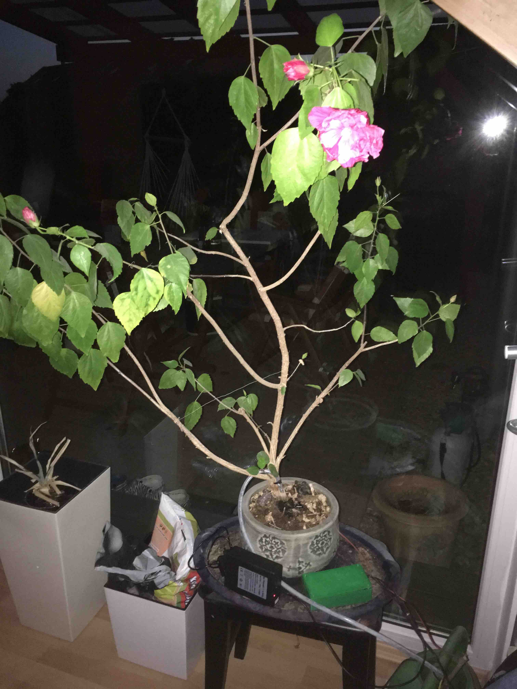

# Automatic Watering based on BigClown

This project solves a common problem of plant watering at home.
It is based on a feedback loop where the watering is initiated by the measurement of soil moisture.
The moisture is measured each 10 seconds. Besides that the temperature neat the plant is also measured.
The watering itself is done by a small 12v pump.
The water level in the water reservoir is measured so that when there is no water the watering is stopped.
All the actions that are done are send using BigClown module to the hub where the results can be analyzed.




## Required components
* BigClown core module ![alt text]


* Soil moisture sensor


* 12V pump


* Power source - a battery pack in my case
* Water level sensor


* Few electronic parts
* Water reservoir

## Schema


```
